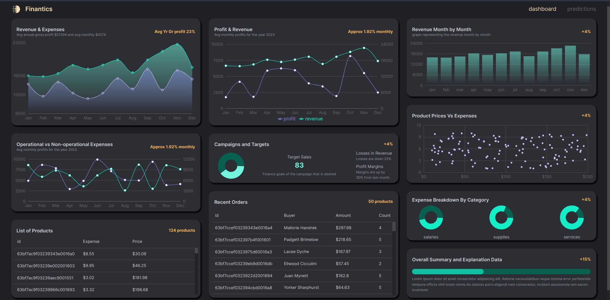

# Finantics (Financial Dashboard)



## About The Project

The financial dashboard with machine learning prediction project aims to create a web-based dashboard that provides users with insights into financial data through machine learning models.

The dashboard will be built using modern web technologies such as ReactJS and NodeJS, and will allow users to visualize key financial metrics such as revenue, expenses, profit, and cash flow. The dashboard will also include a machine learning prediction module that will provide users with forecasts for future financial trends based on historical data.

# Getting Started

## Requirements

- [git](https://git-scm.com/book/en/v2/Getting-Started-Installing-Git)
  - You'll know you did it right if you can run `git --version` and you see a response like `git version x.x.x`
- [Nodejs](https://nodejs.org/en/)
  - You'll know you've installed nodejs right if you can run:
    - `node --version` and get an ouput like: `vx.x.x`
- [Vite](https://vitejs.dev/)
  - You can now create a new React application by typing:
    - ` npm create vite@latest`
- [MonoDB](https://www.mongodb.com/)
  - Please visit the site to setup and installation.

# Built With

- [Node.js](https://nodejs.org/en/)
- [TypeScript](https://www.typescriptlang.org/)
- [MUI](https://mui.com/)
- [Recharts](https://recharts.org/en-US/examples)

## Quickstart

Clone this repo

Create .env file in Server folder you need to provide MONGO_URI and PORT

Create .env file in Client folder copy paste this `VITE_BASE_URL=http://localhost:1337`

```
git clone https://github.com/vaasanthk/finance-app.git
cd finance-app
npm i
npm run dev
```

You should see a link in the terminal to launch the application in your browser.

OR Press letter O to launch.

Deployed on vercel click the below link:
https://finance-5if4np5wy-vaasanthk.vercel.app/


# Thank you!
